# TRMNL Book Times

A literature clock for [TRMNL](https://trmnl.com): every refresh shows a passage from a book that names the current minute, set as a typographic poster. The time words are large and bold, the story around them smaller, the book and its author at the bottom, the time in digits in the corner. 1440 minutes, each with its own passage.

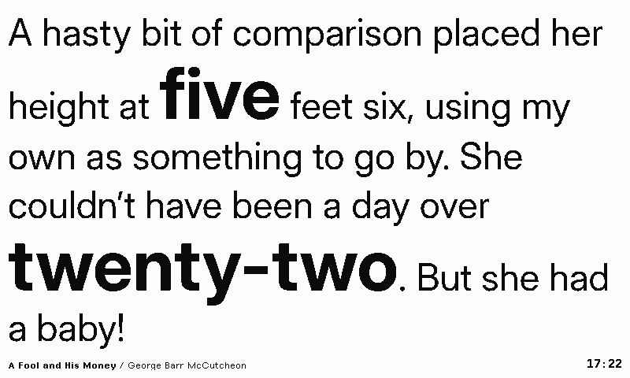

## Layouts

| | |
|---|---|
| 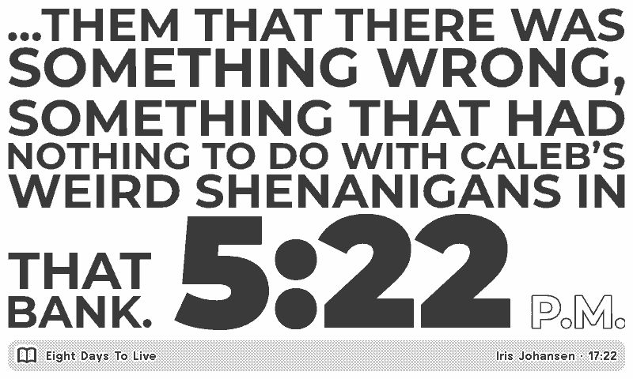 **Full**, TRMNL OG 2-bit: the context in gray | 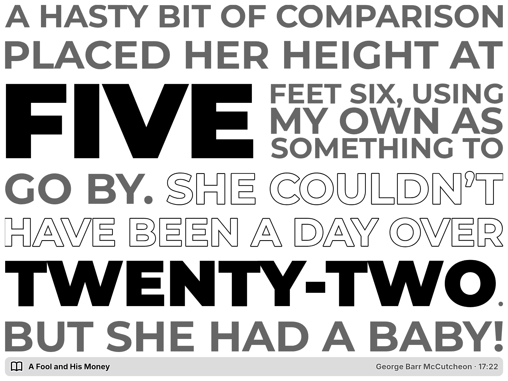 **TRMNL X**, 4-bit |
| 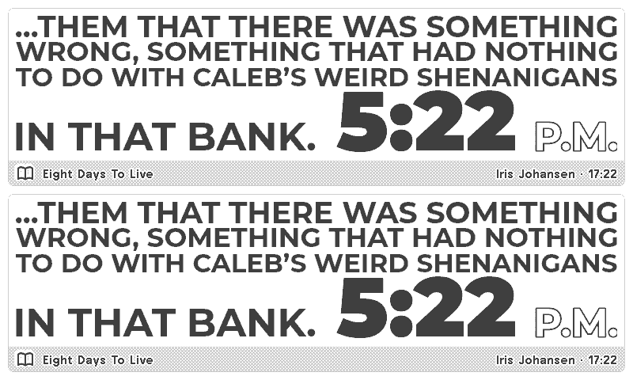 **Half horizontal** (mashup) | 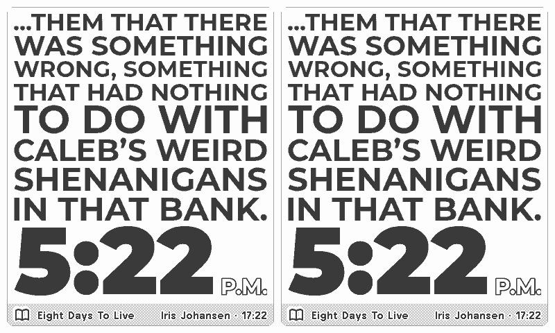 **Half vertical** (mashup) |
| 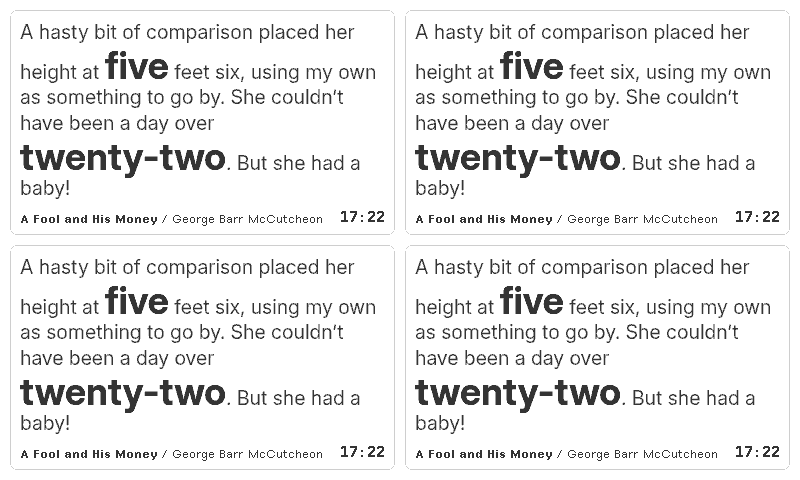 **Quadrant** (mashup) | 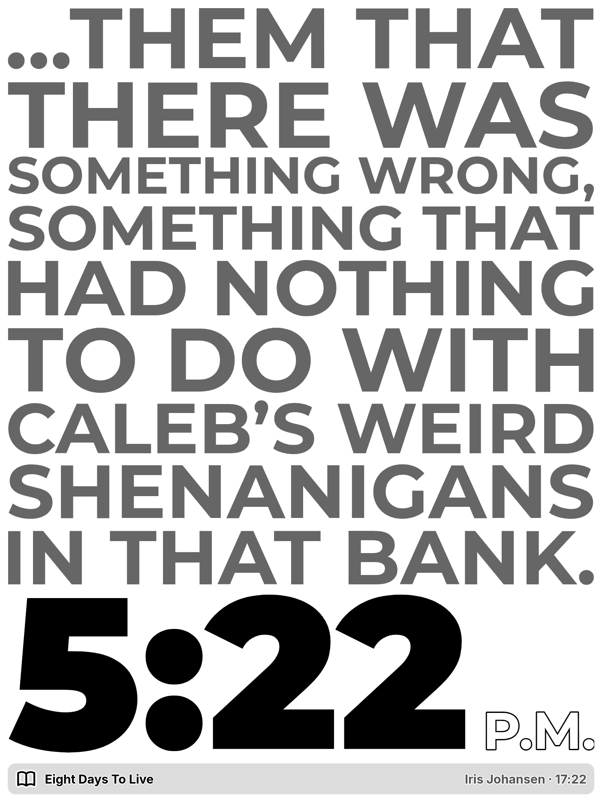 **TRMNL X portrait** |
| 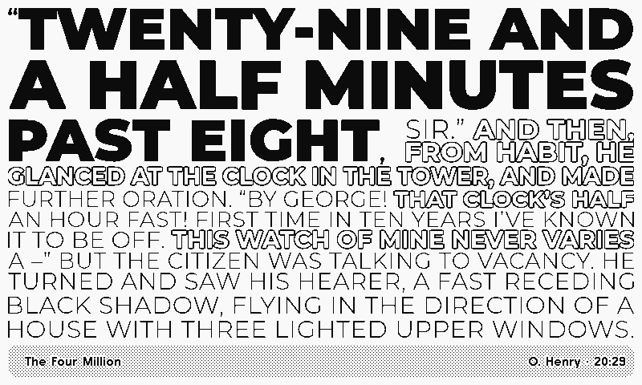 the longest passage (434 characters) | 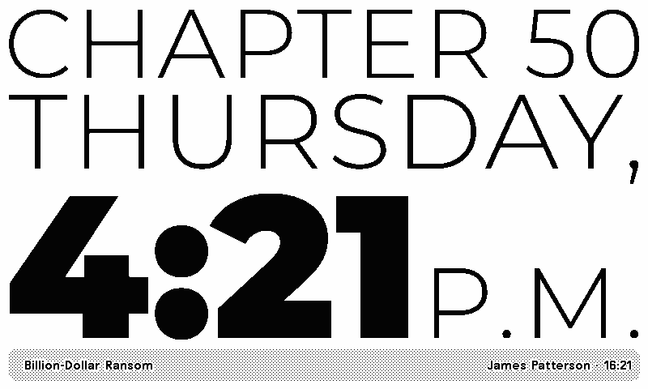 the shortest |
| 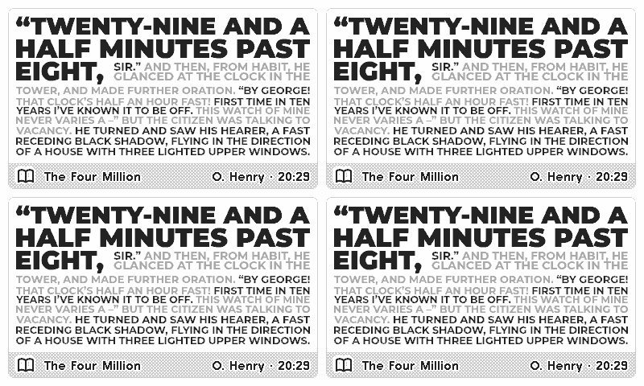 the longest in a quadrant | 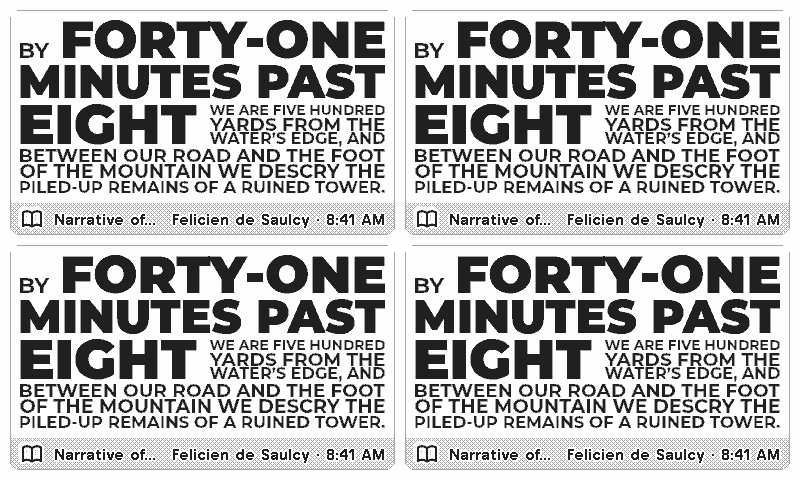 a long title gives way, the author never does (12-hour time) |
| 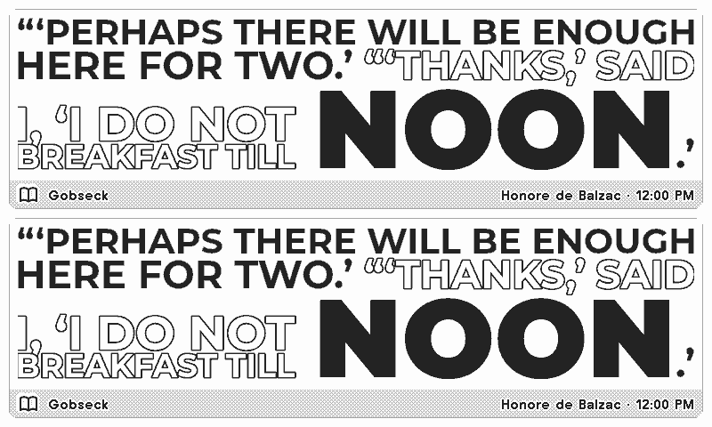 noon: its own passage, not midnight's | 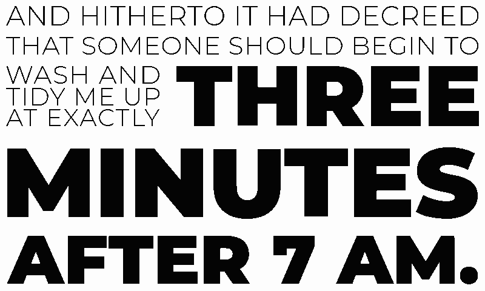 time and attribution off |

## Settings

| Setting | Default | |
|---|---|---|
| Show the Time | on | the minute the passage names, bottom right |
| Hour Format | 24-hour | 13:05 or 1:05 PM |
| Show Title and Author | on | the book and its author, bottom left; keep it on (the passages are quoted with credit) |

## How it works

| Part | Choice | Why |
|---|---|---|
| Data | `docs/m/HHMM.json`, one small file (about 400 bytes) per minute of the day, on GitHub Pages: `https://excusemi.github.io/trmnl-book-times-plugin/m/1305.json` | all 1440 passages (about 560 KB) are over TRMNL's 100 KB limit for a template file or a polled payload; an hourly file would repeat the same payload for an hour and TRMNL skips re-rendering unchanged data |
| Minute | the polling URL names it with Liquid: `{{ "now" \| date: "%s" \| plus: trmnl.user.utc_offset \| date: "%H%M" }}` | TRMNL polls right before it renders, so the passage is for the minute the screen is drawn, in the user's time zone |
| Refresh | every 5 minutes (TRMNL's shortest) | a screen stays up 5 to 15 minutes, so the corner shows which minute the passage is for |
| Fit | a small script in `shared.liquid` searches the largest context size that fits the view (time words 1.9 times as large), after the fonts load; hyphenated time words never break | the framework's fit-value scales one element; a poster mixes two sizes in one flowing text |
| Tones | context black on 1-bit, solid gray (`gray-30`) on 2 and 4-bit; time words black | solid levels, no dithered text |
| No data | if the fetch fails, the time in digits fills the screen | |

### Selection

A port of tiny-paper's literature clock (`plugins/litclock/converter/src/text.ts`), so both pick the same passage per minute.

| Step | Rule |
|---|---|
| 12-hour minute | the best Project Gutenberg public-domain passage; for the 26 minutes Gutenberg lacks, the best sfw quote of the collections |
| 24-hour day | a pick that names its half of the day (the collections' 24-hour time; midnight, noon) and names the other one gives way to the best passage of that minute naming the right half; with none, one passage serves both halves (Gutenberg's are mostly neutral: "twenty past six") |
| Result | 1440 / 1440 minutes; 1387 from Gutenberg; 25 minutes take a passage of their own half (12:00 noon, 19:03, 05:38 and others); 20:41 and 21:29 reuse the morning's quote (no evening one exists) |
| Text | curly quotes, a.m./p.m. as one word, scan page numbers dropped, utrost's "Last, First" authors turned round, subtitles cut from titles |

`data/passages.jsonl` holds the rows the selection can reach (1556 of tiny-paper's 15762: every Gutenberg row, and the sfw collection rows of the minutes that need them), each with its tags (`source`, `rights`, `dataset_license`, `sfw`), so rows can be dropped by source or license later. Every published file carries the same tags.

## Data licenses and credits

The code is MIT (`LICENSE`). The passages are not: each keeps the terms of where it comes from.

| Source | Minutes (of 1440) | Terms |
|---|---|---|
| [Project Gutenberg](https://www.gutenberg.org), books whose every author died by 1955 | 1387 | public domain (EU and US); passages found by tiny-paper's scan |
| [JohsEnevoldsen/literature-clock](https://github.com/JohsEnevoldsen/literature-clock) | 35 | CC BY-NC-SA 2.5: attribution, **non-commercial**, share alike |
| [utrost/LiteratureClock](https://github.com/utrost/LiteratureClock) | 17 | AGPL-3.0 repository; quote rights not addressed |
| [cdmoro/literature-clock](https://github.com/cdmoro/literature-clock) | 1 | MIT for its code; quotes without a verified license |

- The 53 collection minutes quote books that are mostly still in copyright (39 of them), as short excerpts with title and author. Use them for personal, non-commercial display only; `data/` and `docs/m/` are shared under the same terms (CC BY-NC-SA 2.5 and AGPL-3.0 as they apply to each row).
- Every screen shows the book and author unless you switch it off.
- To ship Gutenberg only, drop the collection rows in `tools/build_data.py` (`eligible()`); those minutes then need another source.

## Development

| Task | Command |
|---|---|
| Rebuild the data | `python3 tools/build_data.py` (stdlib only); `--import <tiny-paper>/plugins/litclock/data/passages.json` refreshes `data/passages.jsonl` |
| Data tests | `python3 -m unittest discover -s tests`: picks equal tiny-paper's (`tests/fixtures/tinypaper_sample.json`, 125 minutes, from `node tools/tinypaper_reference.mjs <tiny-paper>/plugins/litclock`), every minute resolves, no nsfw row, `docs/m` is current |
| Render checks | `python3 tests/render.py [--screens]`: 7 passages x 4 layouts x TRMNL OG 1/2-bit and X 4-bit (landscape, portrait), half and quadrant views in a real mashup; fails on overflow, a context under 10 px or a cut author. Needs trmnlp, Chrome and ImageMagick |
| Preview | `cd plugin && trmnlp serve` (polls the live URL; trmnlp fills the polling URL from custom fields only, so there it is the UTC minute's file) |
| Lint | `cd plugin && trmnlp lint` |

Publishing data: push to `main`; GitHub Pages serves `docs/` (`.nojekyll`, no build step).

## Install on TRMNL

Not published yet. To add it as a private plugin:

1. `trmnlp login` (once), then `cd plugin && trmnlp push`: this creates the private plugin on your account and writes its `id` into `plugin/src/settings.yml` (commit that).
2. Or by hand: Plugins, Private Plugin, New; strategy Polling, the polling URL from `plugin/src/settings.yml`, refresh every 5 minutes; paste the four layouts and `shared.liquid` into the markup editor, the custom fields from `settings.yml` into the form builder.
3. Add it to a playlist. Recipes (the public gallery) are published from the plugin's settings page on trmnl.com.
